# Learning OpenGL
## 简介
个人学习 Computer Graphics 及 OpenGL 过程中的代码记录，包括：
1. GAMES101 课程作业，在 other 文件夹下
2. [LearnOpenGL-zh](https://learnopengl-cn.github.io/) 教程的代码环境配置与代码注解（优化文件组织、删去重复注释、添加个人注释）
3. ZJU 24fall《计算机图形学》（by 吴鸿智）课程作业，包括

### GAMES101 课程作业
<div style="gap:10px">
    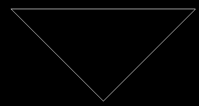
    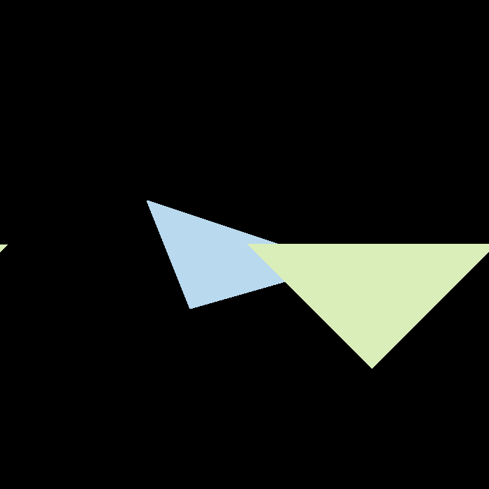
    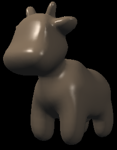
</div>
<div style="gap:10px">
    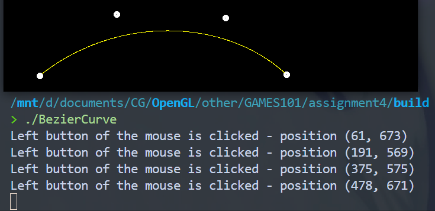
    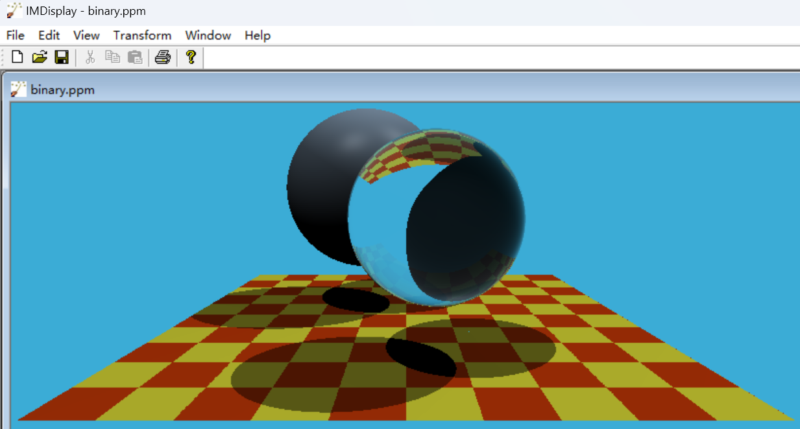
</div>
<div style="gap:10px">
    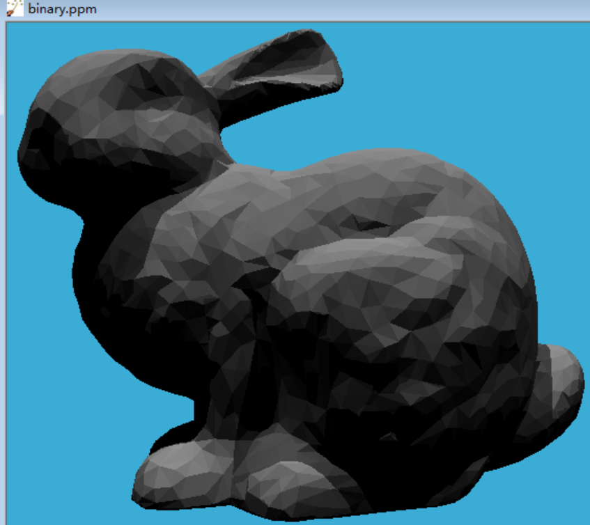
    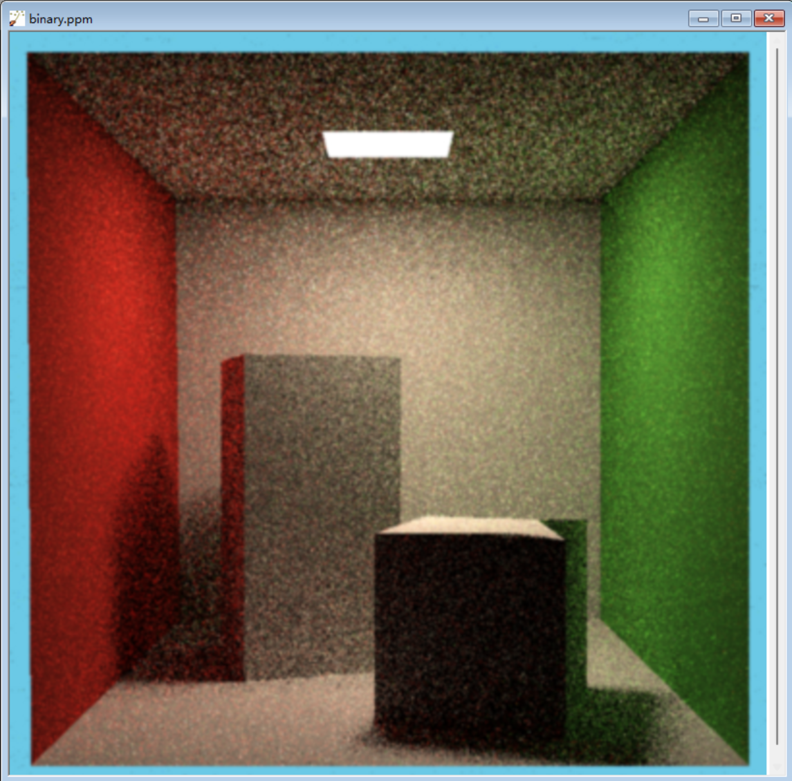
</div>

### LearnOpenGL-zh 教程环境配置与注解
<div style="gap:10px">
    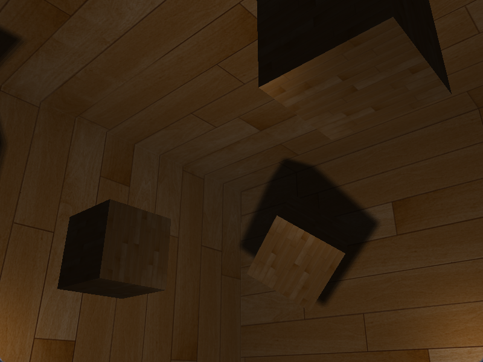
    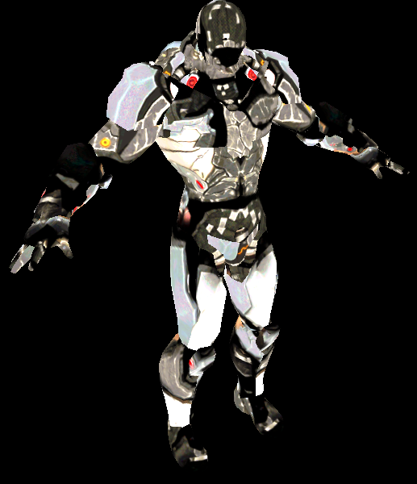
</div>

### ZJU 24fall《计算机图形学》课程作业
```
src
├───1.draw_flag
├───2.draw_rocket
├───3.Solar_System
├───4.Dream_car
├───5.Advanced_Solar_System
└───6*.Final_Project ZeldaDemo 参见我的另一个仓库 https://github.com/crd2333/ZeldaDemo
```
<div style="gap:10px">
    
    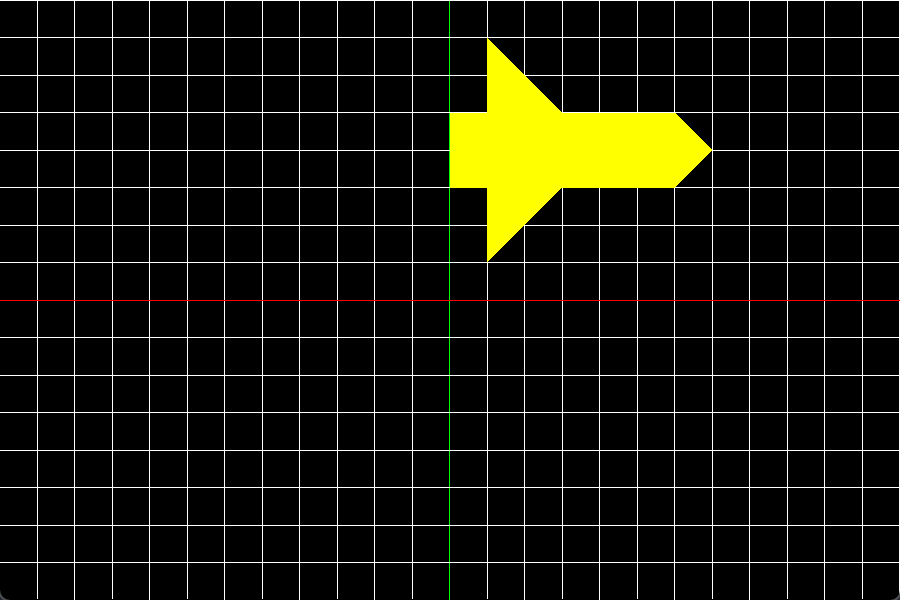
    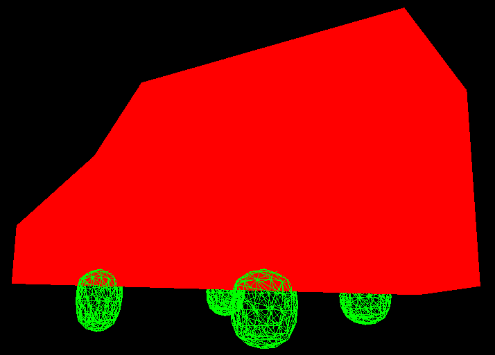
</div>

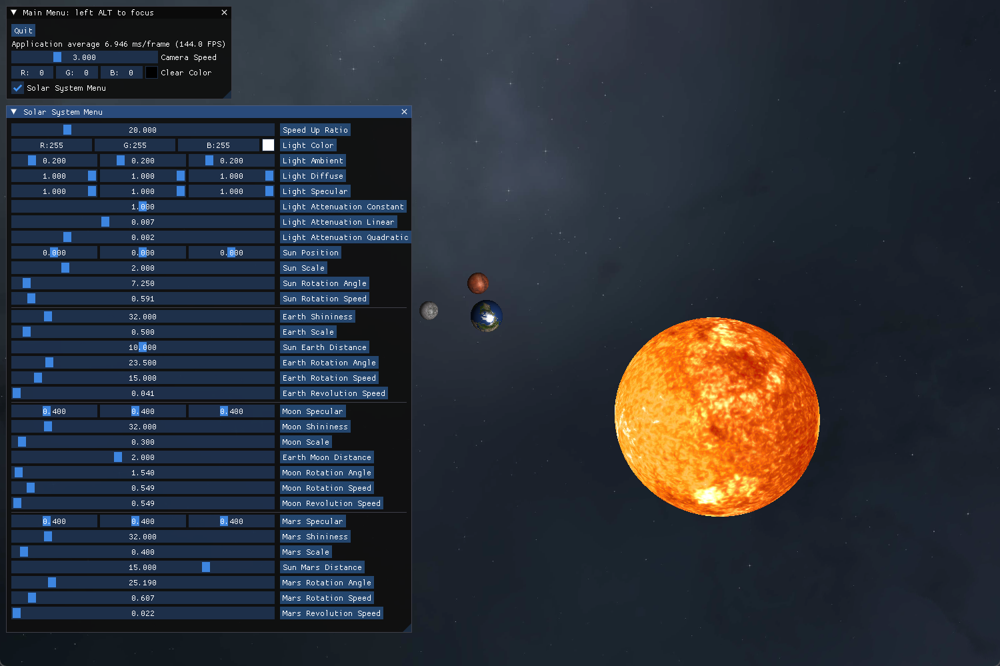

## 环境
- 环境按照 [github/start-learning-opengl](https://github.com/yocover/start-learning-opengl/tree/main) 搭建
  - 不通过笨重的 Visual Studio，使用轻量级的 VSCode + Makefile 编译）
  - 在 windows 下运行，使用 glfw3 + glad
- 文件目录
    ```
    root
    ├── include
    │   ├── imgui
    │   │   └── src
    │   │       ├── imgui.cpp
    │   │       └── ...
    │   ├── GLFW
    │   ├── glad
    │   ├── glm
    │   ├── stb
    │   └── assimp
    ├── lib
    ├── output
    │   ├── glfw3.dll
    │   ├── libassimp-5.dll
    │   └── main.exe
    ├── resources
    ├── src
    │   ├── main.cpp
    │   └── ...
    ├── Makefile
    ├── ...
    └── README.md
    run 'make dir=xxx' at the root to compile
    run 'make run dir=xxx' at the root to compile and run
    run 'make clean dir=xxx' at the root to clean up
    e.g. make run dir=0.LearnOpenGL/5.advanced_lighting/3.2.point_shadows
         make clean dir=load_model
    ```
- 注意
  - `.vscode` 文件夹下的内容需要根据自己的环境进行修改
  - `lib` 文件夹下的动态链接库可能需要重新编译
  - `resources` 文件夹下的资源文件用 `.gitignore` 忽略了，需要自己从 learnopengl 下载